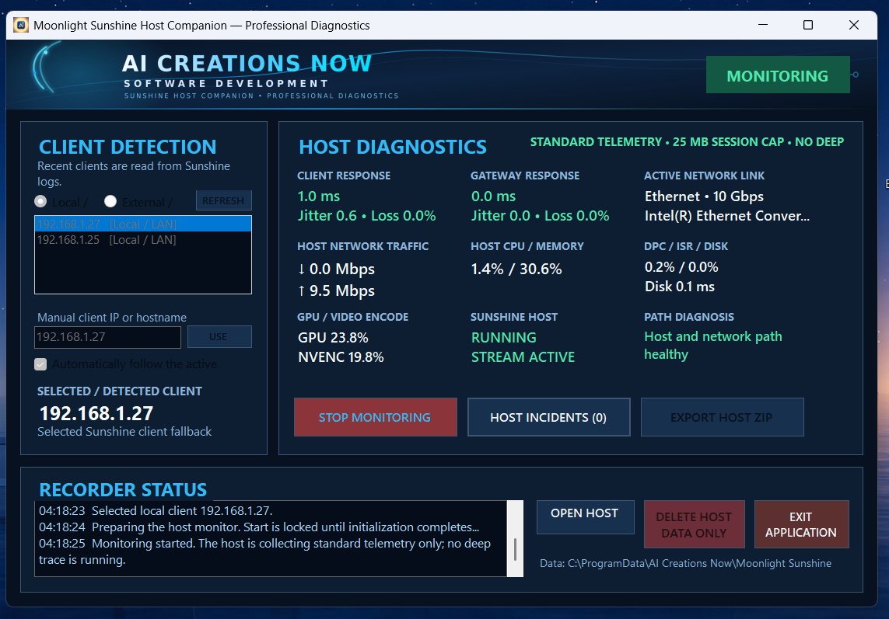

# Moonlight / Sunshine Companion: investigate a streaming stutter

## Collect evidence from both computers

1. Install and configure the official Moonlight client and Sunshine host separately. Confirm that your normal stream works.
2. Install **Moonlight Logger** on the Windows computer you play on. Put the portable **Sunshine Host Companion** on the Windows computer running Sunshine.
3. In the client logger, select the Sunshine host. In the host companion, select the Moonlight client's reachable address.
4. Start **Standard** monitoring on both computers and reproduce the stutter, latency or connection issue.
5. Stop both monitors and export the two diagnostic ZIPs. Keep the pair together and compare the same incident using UTC timestamps.

The screenshot is the official example host dashboard. Addresses and readings belong to one example system; they are not recommended settings or performance targets.

## Common questions

**Do the companions pair with each other?** No. Each collects local evidence and probes the selected endpoint and its gateway. Export both sides to compare their timelines.

**What address should I enter?** Use the opposite computer's address as reachable from the monitoring computer. Across networks, an already configured VPN address may be appropriate. Manual entry does not bypass a firewall or create connectivity.

**Does an unanswered ping prove the stream is broken?** No. Some endpoints block ICMP probes. Compare passive system evidence and streaming logs before drawing a conclusion.

**When should I use Ultra Trace?** Begin with Standard. Client-only Ultra Trace collects deeper Windows evidence, needs Windows Performance Recorder and at least 12 GB free to start, and can produce large files. See the [official guide](https://aicreatenow.com/Moonlight.html) for its capture and storage limits.

Review exports for private network and system details before sending them to [support](SUPPORT.md).

[Back to product overview](README.md) · [Support](SUPPORT.md)
