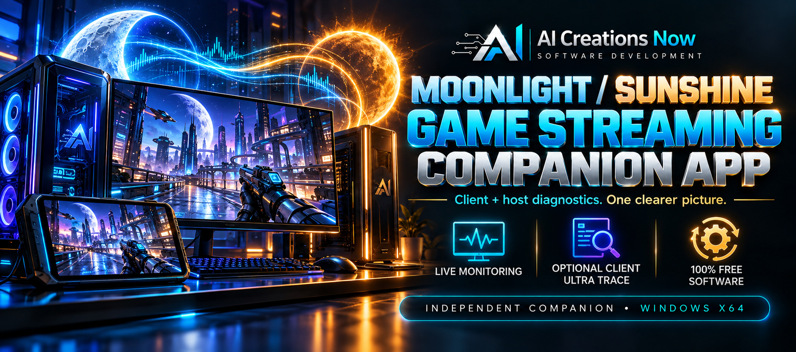
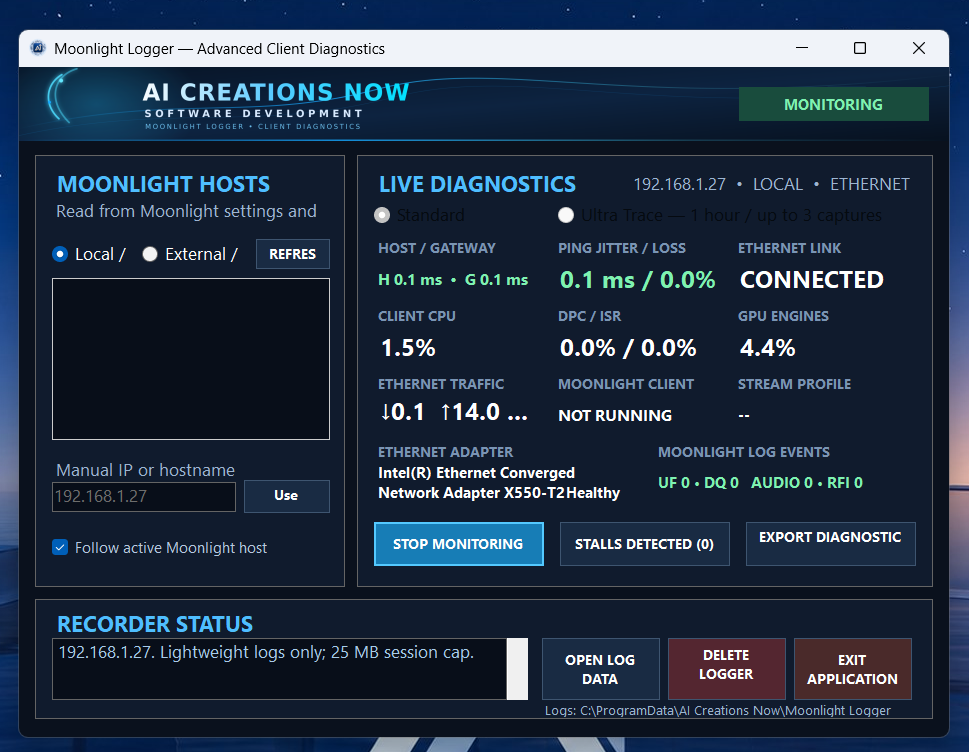

  

<h1 align="center">Moonlight / Sunshine Companion</h1>

**Windows diagnostics for both ends of a game-streaming session.** Moonlight Logger runs on the client; Sunshine Host Companion runs on the host. Together they capture local system and network evidence to help investigate stutters, latency and connection problems.

  <a href="https://aicreatenow.com/Moonlight.html"><strong>Get the apps — official download options</strong></a> · <a href="SUPPORT.md">Support</a>

  

## Features

- Monitor endpoint and gateway response, jitter, packet loss and network activity.
- Record relevant client and host system counters, application events and incident timelines.
- Export separate diagnostic ZIPs and compare the same session using UTC timestamps.
- Use Standard monitoring on either computer or optional client-only Ultra Trace for deeper Windows evidence.
- Select local or remote endpoints already reachable through your network or existing VPN.

## The two apps

| App | Runs on | Published version |
| --- | --- | --- |
| Moonlight Logger | Windows Moonlight client | 2.1.9 — installer |
| Sunshine Host Companion | Windows Sunshine host | 1.0.8 — portable EXE |

## Requirements and setup

For diagnostics at both ends, use a Windows x64 client and host with administrator permission. Obtain and configure [Moonlight](https://moonlight-stream.org/) and [Sunshine](https://app.lizardbyte.dev/Sunshine/) separately, then confirm your normal stream works.

Install Moonlight Logger on the client and run the portable Host Companion on the host. Select the opposite endpoint in each app, start monitoring, reproduce the issue, then stop and export both sessions.

Ultra Trace requires Windows Performance Recorder and at least 12 GB free to start. It runs a one-hour watch period with up to three qualifying incident captures. Logs and exports can contain network and system details; review them before sharing.

## Download and support

Both complete apps are free through the email-request option, with delivery taking up to 24 hours. An **optional $5 non-charitable donation** provides immediate access after successful Stripe checkout. Both routes include the same features, with no subscription.

Use the [official download options](https://aicreatenow.com/Moonlight.html). For free delivery, email [info@aicreatenow.com](mailto:info@aicreatenow.com) with the subject **Request Moonlight Sunshine Companion App Download Link**. See [Support](SUPPORT.md) for delivery or diagnostic help.

## Source and licensing

This repository contains documentation for proprietary software. Application source code is not included. Obtain the application and its applicable terms through the official product page.

Developed independently by AI Creations Now Software Development; not affiliated with the Moonlight or Sunshine projects. These companions collect diagnostic evidence. They do not provide streaming, bypass network restrictions, automatically tune systems or guarantee a repair.
